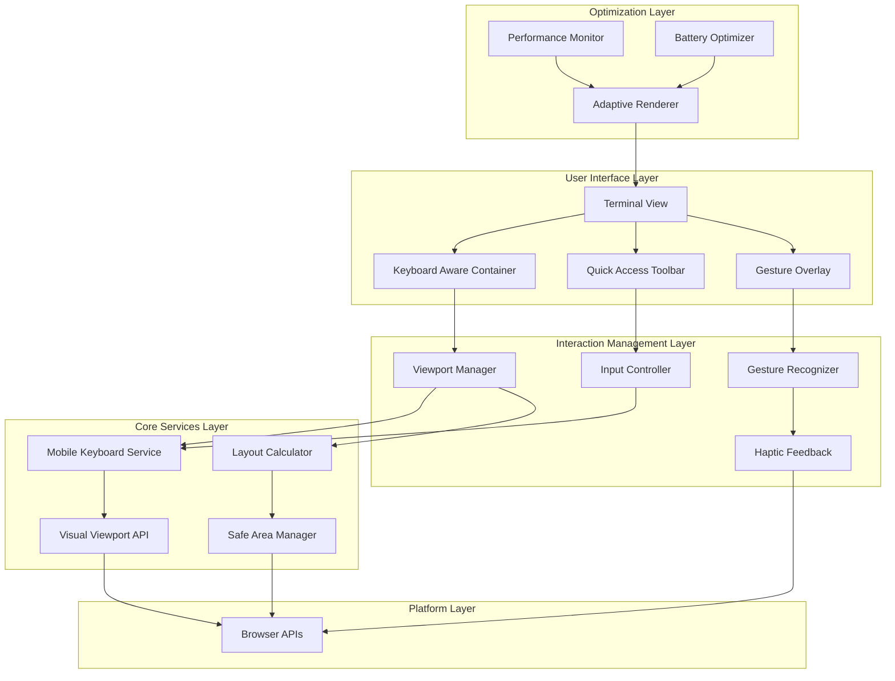
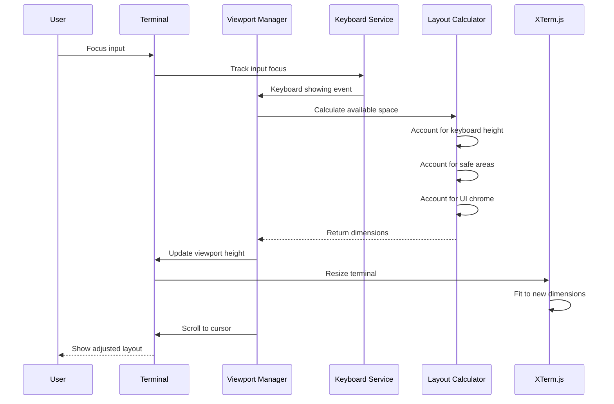

# Design Document

## Overview

This design document outlines the architecture and implementation strategy for optimizing the RiTerm mobile terminal experience. The solution builds upon the existing mobile infrastructure (`MobileKeyboard`, `KeyboardAwareContainer`, `GestureRecognizer`) while introducing new components and enhancements to solve keyboard occlusion issues and improve touch-first interactions.

The design follows a layered architecture approach:
1. **Core Layer**: Enhanced keyboard detection and viewport management
2. **Component Layer**: Adaptive UI components that respond to keyboard and orientation changes
3. **Interaction Layer**: Gesture recognition and haptic feedback systems
4. **Optimization Layer**: Performance monitoring and adaptive rendering

## Architecture

### System Architecture Diagram



### Data Flow



## Components and Interfaces

### 1. Enhanced Viewport Manager

**Purpose**: Centralized management of viewport dimensions, keyboard state, and layout calculations.

**Location**: `src/utils/mobile/ViewportManager.ts` (new file)

**Key Responsibilities**:
- Real-time viewport dimension tracking using Visual Viewport API
- Intelligent keyboard height detection with device-specific thresholds
- Safe area inset management for notched devices
- Smooth transition animations during layout changes
- Debounced resize handling to prevent jank

**Public API**:
- `initialize()`: Set up viewport monitoring
- `calculateTerminalHeight(options)`: Calculate optimal terminal height
- `adjustForKeyboard(keyboardInfo)`: Handle keyboard visibility changes
- `scrollToCursor(cursorPosition)`: Ensure cursor is visible
- `onViewportChange(callback)`: Subscribe to viewport changes

### 2. Adaptive Quick Access Toolbar

**Purpose**: Provide touch-optimized access to common terminal keys and shortcuts.

**Location**: `src/components/ui/QuickAccessToolbar.tsx` (new file)

**Layout Strategy**:
- **Compact Mode** (< 640px width): Single scrollable row with 6-8 most common keys
- **Expanded Mode** (≥ 640px width): 2-3 rows with categorized keys
- **Auto Mode**: Dynamically switches based on available space and orientation

**Default Key Sets**:
- **Essential**: Tab, Ctrl+C, Ctrl+D, Esc, Enter, Arrows
- **Navigation**: Home, End, PgUp, PgDn
- **Editing**: Ctrl+Z, Ctrl+X, Ctrl+V, Ctrl+A
- **Custom**: User-defined shortcuts

**Features**:
- Horizontal scrolling for additional keys
- Haptic feedback on key press
- Long-press for expanded keyboard
- Customizable key layout
- Persistent user preferences

### 3. Enhanced Gesture System

**Purpose**: Extend the existing `GestureRecognizer` with terminal-specific gestures and improved feedback.

**Location**: Enhance existing `src/utils/mobile.ts` `GestureRecognizer` class

**Gesture Mappings**:
- **Two-finger swipe down**: Show keyboard
- **Two-finger swipe up**: Hide keyboard
- **Pinch in/out**: Adjust font size (8px - 24px)
- **Three-finger tap**: Toggle quick actions menu
- **Long press**: Show context menu (copy/paste/select)
- **Two-finger rotate**: Rotate terminal orientation (tablet only)

**Enhancements**:
- Gesture hints overlay (shown on first use)
- Configurable gesture sensitivity
- Gesture conflict resolution
- Visual feedback during gesture recognition
- Gesture history for debugging

### 4. Intelligent Layout Calculator

**Purpose**: Calculate optimal terminal dimensions based on multiple factors.

**Location**: `src/utils/mobile/LayoutCalculator.ts` (new file)

**Calculation Algorithm**:
```
1. Start with base viewport height
2. Subtract safe area insets (top + bottom)
3. Subtract UI chrome heights (header, toolbar, nav)
4. If keyboard visible:
   a. Subtract keyboard height
   b. Add buffer space (50px)
   c. Ensure minimum height (200px)
5. Calculate optimal terminal rows/cols
6. Determine if resize is needed (threshold: 10% change)
7. Set transition duration based on change magnitude
```

**Inputs**:
- Viewport dimensions
- Keyboard state and height
- Device orientation
- Safe area insets
- UI element dimensions
- Device capabilities

**Outputs**:
- Terminal height and width
- Scroll offset adjustment
- Resize necessity flag
- Transition duration
- Debug information

### 5. Keyboard Occlusion Prevention System

**Purpose**: Ensure the active input area is always visible when the keyboard appears.

**Location**: `src/utils/mobile/OcclusionPrevention.ts` (new file)

**Prevention Strategy**:
1. **Proactive Detection**: Monitor keyboard visibility and cursor position
2. **Smart Scrolling**: Calculate minimal scroll needed to reveal input
3. **Buffer Maintenance**: Keep 50px buffer between input and keyboard
4. **Cursor Tracking**: Follow cursor as it moves during typing
5. **Full-screen App Support**: Resize terminal rows for vim/nano/etc.

**Key Methods**:
- `preventOcclusion(element)`: Ensure element is visible
- `checkOcclusion(element)`: Check if element is occluded
- `adjustScroll(adjustment)`: Perform scroll adjustment
- `trackCursor(position)`: Follow cursor movement

### 6. Performance-Aware Renderer

**Purpose**: Adapt rendering quality and frequency based on device capabilities and battery state.

**Location**: Enhance existing `src/utils/performance.ts`

**Adaptive Strategies**:
- **High Performance** (>60 FPS, >4GB RAM): Full animations, smooth scrolling, large buffer
- **Medium Performance** (30-60 FPS, 2-4GB RAM): Reduced animations, standard scrolling
- **Low Performance** (<30 FPS, <2GB RAM): Minimal animations, virtual scrolling, small buffer
- **Power Save Mode** (Battery <20%): Disable animations, reduce refresh rate, minimize reflows

**Quality Levels**:
- Animations enabled/disabled
- Smooth scrolling vs. instant
- Hardware acceleration
- Render throttle timing
- Maximum buffer lines

## Data Models

### Terminal State Model

```typescript
interface TerminalState {
  sessionId: string | null;
  isConnected: boolean;
  connectionStatus: 'disconnected' | 'connecting' | 'connected' | 'reconnecting' | 'failed';
  fontSize: number;
  fontFamily: string;
  theme: TerminalTheme;
  opacity: number;
  rows: number;
  cols: number;
  viewportHeight: number;
  scrollPosition: number;
  keyboardVisible: boolean;
  keyboardHeight: number;
  quickAccessVisible: boolean;
  gestureMode: boolean;
  selectionMode: boolean;
  contextMenuVisible: boolean;
  fps: number;
  renderQuality: QualityLevel;
  powerSaveMode: boolean;
}
```

### Keyboard State Model

```typescript
interface KeyboardState {
  isVisible: boolean;
  height: number;
  transitionState: 'showing' | 'shown' | 'hiding' | 'hidden';
  effectiveViewportHeight: number;
  viewportOffsetTop: number;
  activeInput: HTMLElement | null;
  inputRect: DOMRect | null;
  lastChangeTimestamp: number;
  transitionDuration: number;
  detectionMethod: 'visualViewport' | 'resize' | 'focusin';
  threshold: number;
}
```

### Gesture State Model

```typescript
interface GestureStateModel {
  activeGesture: GestureType | null;
  gestureStartTime: number;
  gesturePoints: TouchPoint[];
  recentGestures: GestureHistory[];
  enabled: boolean;
  hintsVisible: boolean;
  hapticEnabled: boolean;
  gestureCount: number;
  lastGestureTime: number;
  averageGestureLatency: number;
}
```

## Error Handling

### Error Categories

1. **Keyboard Detection Errors**
   - Fallback to resize-based detection
   - Use conservative height estimates (300px default)
   - Log detection method for debugging
   - Enable manual keyboard toggle button

2. **Layout Calculation Errors**
   - Use safe minimum dimensions (200px height)
   - Prevent negative dimensions
   - Gracefully handle missing safe area data
   - Apply last known good dimensions

3. **Gesture Recognition Errors**
   - Ignore ambiguous gestures
   - Provide visual feedback for failed gestures
   - Allow gesture cancellation
   - Show gesture hints after repeated failures

4. **Performance Degradation**
   - Automatically reduce quality level
   - Disable non-essential animations
   - Notify user of performance mode changes
   - Suggest app restart if persistent

## Testing Strategy

### Unit Testing

**Components to Test**:
- `ViewportManager`: Dimension calculations, keyboard detection
- `LayoutCalculator`: Layout algorithm correctness
- `OcclusionPrevention`: Scroll adjustment calculations
- `GestureRecognizer`: Gesture pattern matching
- `AdaptiveRenderer`: Quality level selection

### Integration Testing

**Scenarios**:
1. Keyboard Show/Hide Cycle
2. Orientation Change with Keyboard
3. Gesture Interaction Flow
4. Performance Degradation

### Device Testing Matrix

| Device | Screen Size | OS | Test Focus |
|--------|-------------|-----|------------|
| iPhone SE | 375x667 | iOS 15+ | Compact layout, keyboard occlusion |
| iPhone 14 Pro | 393x852 | iOS 16+ | Safe areas, dynamic island |
| Samsung Galaxy S21 | 360x800 | Android 11+ | Gesture navigation, keyboard variants |
| iPad Mini | 744x1133 | iPadOS 15+ | Tablet layout, split keyboard |
| Pixel 6 | 412x915 | Android 12+ | Material You keyboard, gestures |

### Performance Benchmarks

**Target Metrics**:
- Keyboard transition: <300ms
- Layout recalculation: <150ms
- Gesture recognition: <100ms
- Terminal resize: <200ms
- Frame rate: ≥30 FPS (≥60 FPS on high-end devices)
- Memory usage: <100MB additional overhead

## Accessibility Considerations

### Screen Reader Support
- Announce keyboard visibility changes
- Provide text alternatives for gesture hints
- Ensure all toolbar buttons have accessible labels
- Support keyboard-only navigation
- Respect reduced motion preferences

### High Contrast Mode
- Minimum contrast ratio 7:1
- Border emphasis for UI elements
- Clear visual indicators

### Font Scaling
- Respect system font size preferences
- Allow terminal font size 8px - 24px
- Maintain minimum touch target size (44x44px)
- Scale UI proportionally with font size

## Deployment Strategy

### Phased Rollout

**Phase 1: Core Infrastructure** (Week 1-2)
- Enhanced `ViewportManager`
- Improved keyboard detection
- Basic layout calculator

**Phase 2: UI Components** (Week 3-4)
- Quick access toolbar
- Enhanced gesture system
- Occlusion prevention

**Phase 3: Optimization** (Week 5-6)
- Adaptive renderer
- Performance monitoring
- Battery optimization

**Phase 4: Polish** (Week 7-8)
- Accessibility improvements
- Error handling refinement
- Comprehensive testing

### Feature Flags

Enable gradual rollout and easy rollback:
- `enhancedKeyboardDetection`
- `quickAccessToolbar`
- `advancedGestures`
- `adaptiveRendering`
- `occlusionPrevention`
- `performanceMonitoring`

## Future Enhancements

1. **AI-Powered Layout Optimization**: Learn user preferences over time
2. **Multi-Terminal Support**: Split-screen and tab-based management
3. **Advanced Gesture Library**: Custom gesture recording and macros
4. **Offline Mode**: Local terminal emulation and cached history
5. **Collaborative Features**: Shared sessions and real-time collaboration
